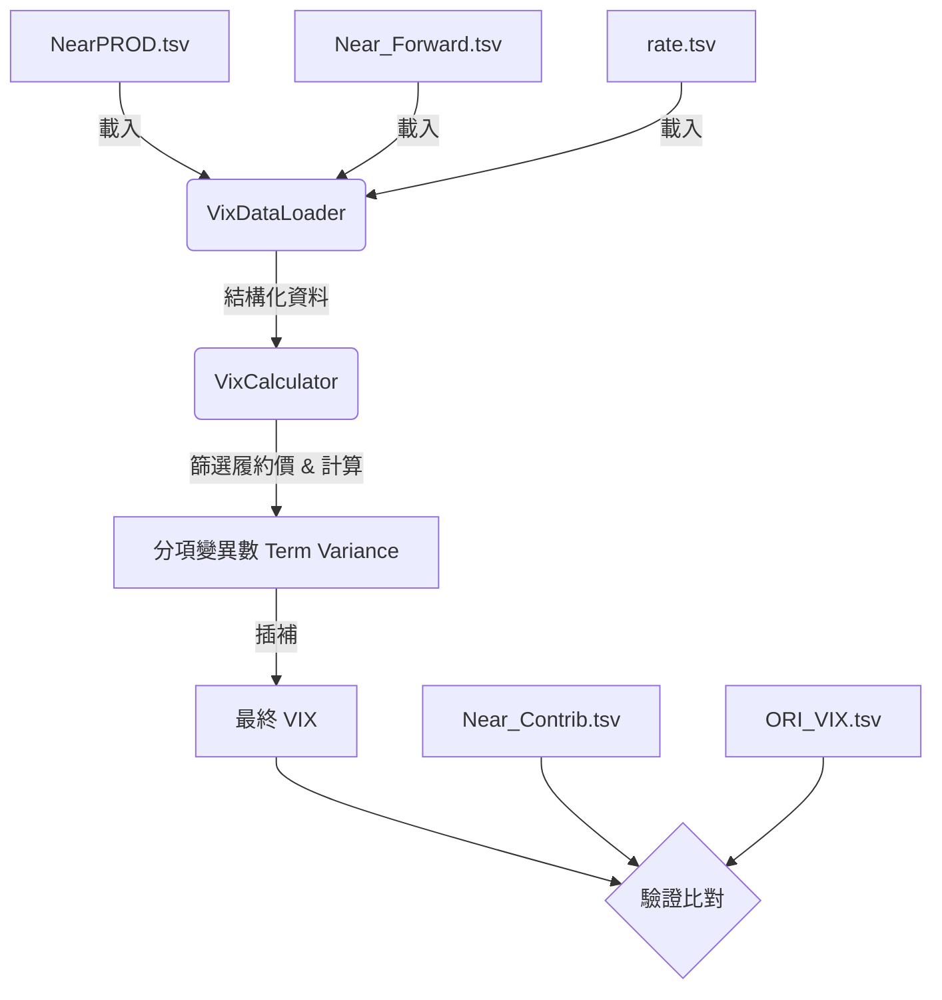

# VIX 計算模組實作計畫

本計畫概述了實作台灣期貨交易所 (TAIFEX) VIX 指數計算的架構。目標是使用提供的市場快照資料 (`NearPROD`, `NextPROD`)、遠期價格 (`Near_Forward`) 和利率 (`rate`) 來計算 VIX。

## 用戶審閱事項
> [!IMPORTANT]
> **資料來源假設**：本實作假設 `NearPROD` 和 `NextPROD` TSV 檔案是主要的「委託簿快照」，其中已經包含了每個時間戳記的有效報價 (`snapshot_call_bid`, `snapshot_call_ask` 等)。我們將依賴這些快照進行後續計算，除非您提供了原始 Tick 資料並要求我們進行「委託簿重建」。

## 建議架構

系統將分為三個主要組件：**資料讀取器 (Loader)**、**VIX 計算核心 (Calculator)** 和 **驗證器 (Verifier)**。

### 1. 資料處理層 (`loader.py`)
負責讀取 TSV 檔案並將其轉換為易於查詢的結構。

- **`VixDataLoader` 類別**:
    - **`load_snapshots(term)`**: 讀取 `NearPROD`/`NextPROD`。
        - *關鍵欄位*: `date`, `time`, `snapshot_sysID`, `strike`, `snapshot_call_bid`, `snapshot_call_ask`。
        - *輸出*: 以 `[time, strike]` 為索引的 DataFrame。
    - **`load_forward_params(term)`**: 讀取 `Near_Forward`/`Next_Forward`。
        - *關鍵欄位*: `tw_fwd` ($F$, 遠期價格), `k0` ($K_0$, 價平履約價)。
        - *輸出*: 以 `time` 為索引的 DataFrame。
    - **`load_rates()`**: 讀取 `rate.tsv`。
        - *關鍵欄位*: `near_days`, `near_r`, `next_days`, `next_r`。
        - *輸出*: 包含 $R$ (無風險利率) 和 $T$ (距到期時間) 參數的字典或 DataFrame。

### 2. 核心計算引擎 (`calculator.py`)
實作 VIX 方法論文件中定義的數學邏輯。

- **`VixCalculator` 類別**:
    - **`calculate_term_sigma(snapshots_df, forward_df, R, T)`**:
        - **Step 0: 序列價格篩選 (Series-Level Filtering) [依據附錄 3 與 spec.md]**:
            - **步驟一：獲取序列有效報價 (Valid Quote 資訊)**:
                - 定義候選報價：
                    - `Q_Last_Valid_t`: 時間點 t 前最後一筆報價，且已通過有效性檢查。
                    - `Q_Min_Valid_t`: 時間點 t 前 15 秒內，買賣價差最小且時間最晚之報價，且已通過有效性檢查。
                - 檢查有效性 (Validity Check)：
                    - 買價 (Bid) 與賣價 (Ask) 須為數值。
                    - Bid >= 0 且 Ask > Bid。
            - **步驟二：判斷報價是否為「異常值」 (Outlier Detection)**:
                - **2.1 計算價差 EMA (Exponential Moving Average)**：
                    - **參數**：alpha = 0.95
                    - **遞迴公式**：
                        - 若 EMA_t-1 為 null（第一次計算）：EMA_t = Spread(Q_Min_Valid_t)
                        - 若 Q_Min_Valid_t 為 null（當前無有效報價）：EMA_t = EMA_t-1
                        - 正常情況：EMA_t = 0.05 × EMA_t-1 + 0.95 × Spread(Q_Min_Valid_t)
                    - **初始值**：若第1個時間區間無有效報價 → EMA_0 = null
                - **2.2 決定 Gamma (γ)**：
                    - Q_Last_Valid_t 與 Q_Min_Valid_t 各自獨立計算 gamma，參考對象為 Q_hat_Mid_t-1：
                        - 若 Bid_t > 0 且 Mid_t <= Q_hat_Mid_t-1 → γ = γ1 (2.0)
                        - 若 Bid_t > 0 且 Mid_t > Q_hat_Mid_t-1 → γ = γ2 (2.5)
                        - 若 Bid_t = 0 → γ = γ0 (1.2)
                - **2.3 異常判定條件 (符合任一即為非異常值)**：
                    - Condition 1: Spread <= gamma × EMA_t
                    - Condition 2: Spread < lambda (lambda = 0.5)
                    - Condition 3: Bid_t > Q_hat_Mid_t-1 (買價突破上一期中價)
                    - Condition 4: Ask_t < Q_hat_Mid_t-1 且 Bid_t > 0 (賣價跌破上一期中價)
                    - **例外**：若為當日第一筆資料或 Q_hat_Mid_t-1 為 null，則視為非異常值。
            - **步驟三：篩選後報價之決定 (Determine Filtered Quotes)**:
                - **優先順序 1**: 若 Q_Last_Valid_t 為非 Null 且非異常值 → Q_hat_t = Q_Last_Valid_t
                - **優先順序 2**: 若 Q_Last_Valid_t 為異常值或 Null，但 Q_Min_Valid_t 有雙邊報價且非異常值 → Q_hat_t = Q_Min_Valid_t
                - **優先順序 3**: 若上述皆不符 → Q_hat_t = Q_hat_t-1 (沿用上一次的結果)

        - **Step 1: 履約價篩選 (Strike Selection)**:
            - 根據 `forward_df` 中的 $K_0$ (ATM Strike) 向外篩選。
            - 應用「連續兩檔零買價」的截斷規則 (Zero Bid Truncation Rule)。（需確認台指 VIX 是否完全參照此 Cboe 規則）。
        - **步驟 2：中間價計算 (Mid-Price Calculation)**:
            - 對每個序列計算 $Q(K_i)$ (中間價)。
        - **步驟 3：變異數貢獻度 (Contribution)**:
            - 計算每個履約價的貢獻度：$\frac{\Delta K_i}{K_i^2} e^{RT} Q(K_i)$。
            - *驗證點*: 可與 `Near_Contrib.tsv` 比對。
        - **步驟 4：總和與公式 (Aggregation)**:
            - 加總貢獻度得到 $\sigma^2$。
            - 公式：$\sigma^2 = \frac{2}{T} \sum \frac{\Delta K_i}{K_i^2} e^{RT} Q(K_i) - \frac{1}{T} (\frac{F}{K_0} - 1)^2$。
    - **`compute_final_vix(near_sigma, next_sigma, ...)`**:
        - 對近月與次近月的變異數進行時間加權插補。
        - 計算最終的 30 天期 VIX 值。

### 3. 驗證與分析 (`verifier.py`)
確保實作結果與官方提供的數據一致。

- **`Verifier` 類別**:
    - **`compare_contributions(calculated_df, reference_file)`**:
        - 載入 `Near_Contrib_20251231.tsv`。
        - 依 `time` + `strike` 進行 Join 比對。
        - 報告誤差超過容許值 (如 1e-6) 的項目。
    - **`compare_forward(calculated_F, reference_F)`**:
        - 雖然我們直接使用 `Near_Forward`，但也可以保留此功能以供未來驗證 $F$ 的計算邏輯。

## 資料流管道 (Pipeline)



## 專案目錄結構
```text
vix_calculator/
├── main.py           # 程式入口
├── loader.py         # 資料讀取
├── calculator.py     # 數學邏輯
└── verifier.py       # 驗證比對
```

## 驗證計畫

### 自動化測試
- **單元測試**: 計算單一履約價 (例如 Strike 10000) 的貢獻度，並與 `Near_Contrib` 的該行數據比對。
- **整合測試**: 執行 20251231 整日的運算，並繪製與 `ORI_VIX` 的誤差圖表。

### 手動驗證
- 輸出 CSV 報告：`Time | My_VIX | Official_VIX | Diff`。
